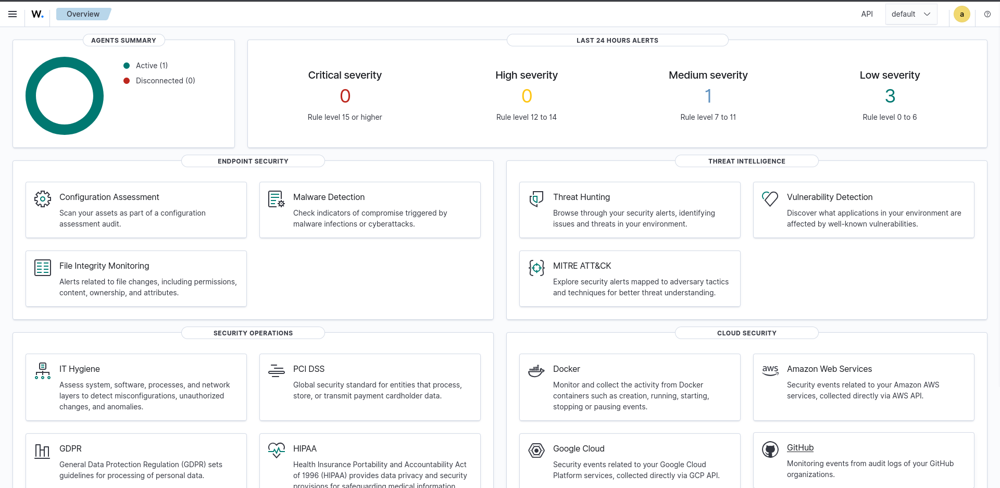
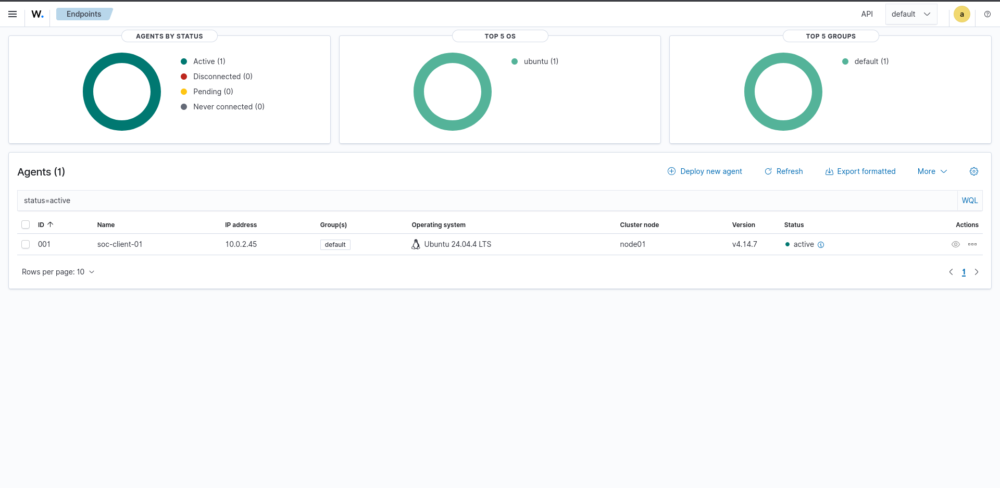
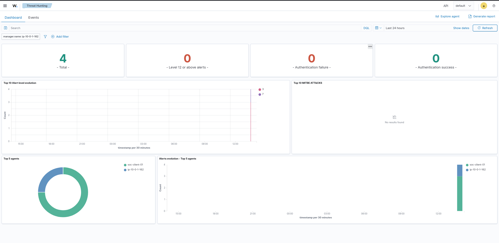

# Cloud SOC Lab on AWS using Wazuh

A hands-on, production-inspired Security Operations Center (SOC) lab built on **Amazon Web Services (AWS)** using **Wazuh** as the central SIEM and security monitoring platform.

This project is designed as an operational SOC environment rather than a simple SIEM installation. The environment is used to generate, collect, detect, investigate, classify, and document security events in a controlled lab.

The project combines **AWS infrastructure, Linux endpoint telemetry, Wazuh SIEM, security event investigation, MITRE ATT&CK mapping, incident response, threat hunting, and detection engineering**.

---

## Project Overview

The goal of this project is to simulate the workflow of a junior SOC analyst working with a centralized security monitoring platform.

Instead of only deploying Wazuh, the lab is continuously used to practice the complete security operations lifecycle:

```text
Security Event
      ↓
Telemetry Collection
      ↓
Wazuh Detection
      ↓
Alert Triage
      ↓
Evidence Validation
      ↓
Investigation
      ↓
Event Correlation
      ↓
MITRE ATT&CK Mapping
      ↓
True Positive / False Positive Classification
      ↓
Severity Assessment
      ↓
Response / Containment
      ↓
Incident Documentation
      ↓
Detection Improvement
```

The environment is intentionally controlled, allowing security events and attack techniques to be safely reproduced and investigated.

---

# Objectives

* Build a cloud-based SOC environment on AWS.
* Deploy and operate a Wazuh SIEM platform.
* Deploy Wazuh Manager, Indexer, and Dashboard.
* Configure secure AWS networking between the SOC components.
* Deploy and enroll Linux endpoints.
* Centralize endpoint security telemetry.
* Investigate authentication and system security events.
* Understand Wazuh alert generation and rule matching.
* Perform alert triage and evidence validation.
* Distinguish security detections from actual malicious activity.
* Map relevant detections to MITRE ATT&CK.
* Practice incident response and containment decisions.
* Perform threat hunting using collected telemetry.
* Develop and improve security detections.
* Produce professional incident investigation reports.
* Maintain reproducible technical documentation.
* Build practical SOC analyst experience through continuous hands-on investigation.

---

# Learning Goals

This project is being used to develop practical knowledge in:

### Security Operations

* Alert monitoring
* Alert triage
* Event validation
* Incident classification
* Severity assessment
* Escalation decisions
* Containment concepts
* Incident closure
* SOC documentation

### SIEM

* Wazuh architecture
* Log collection
* Log normalization
* Decoders
* Detection rules
* Alert severity
* Rule groups
* Security event investigation
* Threat hunting
* MITRE ATT&CK integration

### Endpoint Security

* Linux authentication telemetry
* SSH monitoring
* PAM events
* Sudo activity
* Systemd events
* Endpoint inventory
* File Integrity Monitoring
* Security Configuration Assessment

### Detection Engineering

* Understanding existing Wazuh rules
* Identifying detection gaps
* Creating controlled security events
* Testing detections
* Validating alert generation
* Improving detection logic
* Mapping detections to ATT&CK techniques

### Incident Response

* Initial triage
* Evidence collection
* Timeline construction
* Scope determination
* Root-cause analysis
* Containment
* Recovery considerations
* Incident reporting

---

# Architecture

The current SOC environment is hosted inside an AWS VPC.

```text
                         Internet
                            │
                            │
                     SOC Analyst / Kali
                            │
                            │ SSH / HTTPS
                            ▼
                 ┌──────────────────────┐
                 │   AWS Public Subnet  │
                 │                      │
                 │   Wazuh SOC Server   │
                 │                      │
                 │   Ubuntu 24.04       │
                 │   Wazuh Manager      │
                 │   Wazuh Indexer      │
                 │   Wazuh Dashboard    │
                 │   Filebeat           │
                 │                      │
                 │   10.0.1.162         │
                 └──────────┬───────────┘
                            │
                 ┌──────────┴───────────┐
                 │     AWS VPC           │
                 │                       │
                 │   Private Subnet      │
                 │                       │
                 │   SOC Client          │
                 │   Ubuntu 24.04        │
                 │   Wazuh Agent        │
                 │                       │
                 │   10.0.2.45           │
                 └───────────────────────┘
```

### Current Components

| Component         | Role                                      |
| ----------------- | ----------------------------------------- |
| AWS VPC           | Isolated SOC network                      |
| Public Subnet     | Wazuh server access                       |
| Private Subnet    | Protected endpoint environment            |
| Wazuh Manager     | Detection and security event processing   |
| Wazuh Indexer     | Security event storage and search         |
| Wazuh Dashboard   | SOC analyst interface                     |
| Filebeat          | Event forwarding to the indexer           |
| Ubuntu SOC Client | Monitored endpoint                        |
| Wazuh Agent       | Endpoint telemetry collection             |
| Kali Linux        | SOC administration and controlled testing |

---

# AWS Environment

### Network

```text
VPC: soc-vpc
Wazuh Server: 10.0.1.162
SOC Client:   10.0.2.45
```

The Wazuh server is positioned in the public subnet for administrative and dashboard access.

The SOC client is positioned in a private subnet and does not require direct public exposure.

### Security Groups

The environment uses separate security groups for the Wazuh server and monitored endpoint.

#### Wazuh Server Security Group

Relevant traffic includes:

```text
SSH       → Administrative access
HTTPS     → Wazuh Dashboard
1514/TCP  → Wazuh agent communication
1515/TCP  → Agent enrollment
```

Agent communication is restricted to the appropriate internal AWS security group rather than exposing Wazuh agent ports unnecessarily to the Internet.

#### SOC Client Security Group

The client is privately accessible and allows administrative SSH access through the Wazuh server/jump-host path.

---

# Wazuh Platform

The current deployment uses:

```text
Wazuh Version: 4.14.7

Wazuh Manager
Wazuh Indexer
Wazuh Dashboard
Filebeat
```

The Wazuh services have been validated on the server and the platform is actively being used for security monitoring.

---

# Wazuh SIEM Dashboard

The Wazuh Dashboard is the primary analyst interface for monitoring and investigating the environment.

It provides access to:

* Security alerts
* Endpoint status
* Threat hunting
* MITRE ATT&CK
* File Integrity Monitoring
* Vulnerability Detection
* Security Configuration Assessment
* Security operations modules
* Cloud security integrations



*Wazuh SIEM overview showing the active monitored endpoint and available security monitoring capabilities.*

---

# Monitored Endpoint

The current monitored endpoint is an Ubuntu 24.04.4 LTS system running the Wazuh agent.

```text
Agent ID:       001
Agent Name:     soc-client-01
IP Address:     10.0.2.45
Operating System: Ubuntu 24.04.4 LTS
Wazuh Agent:    4.14.7
Status:         Active
```



*Wazuh endpoint inventory showing the enrolled Ubuntu endpoint in active status.*

---

# Telemetry Pipeline

The lab validates the complete telemetry path from endpoint activity to SIEM detection.

```text
Endpoint Activity
       ↓
Systemd Journal / System Logs
       ↓
Wazuh Agent
       ↓
Wazuh Manager
       ↓
Pre-decoder
       ↓
Decoder
       ↓
Detection Rule
       ↓
Security Alert
       ↓
Wazuh Indexer
       ↓
Wazuh Dashboard
       ↓
SOC Analyst Investigation
```

This pipeline has been validated using controlled security events generated against the monitored endpoint.

---

# Current Detection Coverage

The environment currently provides telemetry and detection coverage for events including:

* SSH authentication activity
* Invalid SSH users
* Authentication failures
* Authentication success
* PAM session creation
* PAM session termination
* Sudo activity
* Systemd events
* Endpoint security events
* Security Configuration Assessment events

Detection coverage will continue to expand as additional attack scenarios and data sources are introduced.

---

# SOC Investigation Workflow

Every investigation follows a structured SOC workflow.

```text
1. Alert
   ↓
2. Triage
   ↓
3. Validate Evidence
   ↓
4. Investigate
   ↓
5. Correlate Events
   ↓
6. Map MITRE ATT&CK
   ↓
7. Determine TP / FP
   ↓
8. Assess Severity
   ↓
9. Respond / Contain
   ↓
10. Document
   ↓
11. Improve Detection
```

A critical principle of this lab is:

> A detection is not automatically an incident.

For example, a Wazuh SSH alert can represent a correctly detected event while the underlying activity may still be authorized or benign. Each alert therefore requires contextual validation before being classified as malicious.

---

# Incident Investigations

Security incidents are documented using structured investigation reports.

Each investigation focuses on:

* Alert identification
* Initial triage
* Source and destination analysis
* Authentication context
* Timeline reconstruction
* Related events
* Evidence validation
* MITRE ATT&CK mapping
* True Positive / False Positive determination
* Severity assessment
* Response actions
* Lessons learned
* Detection improvement opportunities

Example investigation:

```text
INC-001
SSH Invalid User Authentication Attempt
```

Investigation documentation is maintained under:

```text
docs/incidents/
```

---

# MITRE ATT&CK

Relevant security events are mapped to the **MITRE ATT&CK framework** where applicable.

Example techniques observed through SSH-related detections include:

| Technique                      | ID        | Context                                     |
| ------------------------------ | --------- | ------------------------------------------- |
| Remote Services: SSH           | T1021.004 | SSH activity against the monitored endpoint |
| Brute Force: Password Guessing | T1110.001 | Authentication-related detection context    |

MITRE mappings are treated as contextual evidence rather than proof that an attacker successfully compromised the endpoint.

---

# Controlled Security Testing

The lab uses controlled activities to generate security telemetry.

Examples include:

* Invalid SSH login attempts
* Authentication failure scenarios
* SSH authentication success
* Privileged command execution
* System service events
* Endpoint activity
* Network reconnaissance
* Additional attack simulations planned for future investigations

All testing is performed against infrastructure owned and controlled within the lab environment.

---

# Threat Hunting

Threat hunting is performed using Wazuh telemetry rather than relying only on generated alerts.

The hunting process includes:

* Searching security events
* Filtering by endpoint
* Filtering by rule level
* Filtering by rule ID
* Investigating authentication activity
* Reviewing event timelines
* Correlating related events
* Looking for suspicious patterns
* Identifying potential detection gaps

The objective is to move from:

```text
Alert-driven monitoring
```

toward:

```text
Hypothesis-driven threat hunting
```

---

# Detection Engineering

Detection engineering is an ongoing part of the project.

The process includes:

```text
Security Technique
       ↓
Generate Controlled Activity
       ↓
Collect Telemetry
       ↓
Analyze Raw Event
       ↓
Understand Decoder
       ↓
Review Existing Rule
       ↓
Test Detection
       ↓
Validate Alert
       ↓
Map MITRE ATT&CK
       ↓
Document Detection
       ↓
Tune / Improve
```

Future detection engineering work will include custom Wazuh rules and decoders where the existing detection coverage is insufficient.

---

# Incident Documentation

Each investigation is documented with evidence rather than only conclusions.

Typical documentation includes:

```text
Incident Overview
Detection Source
Alert Evidence
Timeline
Source / Destination
Affected Endpoint
User / Account
Authentication Context
Investigation
MITRE ATT&CK Mapping
Impact Assessment
TP / FP Classification
Severity
Response Actions
Containment
Lessons Learned
Detection Improvement
```

This documentation is maintained under:

```text
docs/incidents/
```

---

# Repository Structure

```text
.
├── README.md
│
├── architecture/
│   ├── architecture.md
│   └── ...
│
├── diagrams/
│   ├── soc-architecture.png
│   └── ...
│
├── docs/
│   ├── screenshots/
│   │   ├── wazuh-overview.png
│   │   └── wazuh-endpoint.png
│   │
│   ├── incidents/
│   │   ├── INC-001-ssh-invalid-user.md
│   │   └── ...
│   │
│   ├── investigations/
│   │   └── ...
│   │
│   └── detection-engineering/
│       └── ...
│
```

# Dashboard Evidence

The SOC environment is actively monitored through the Wazuh Dashboard. The following screenshots provide visual evidence of the deployed and operational SIEM environment.

## Wazuh Overview Dashboard

The Wazuh Overview dashboard provides a high-level view of the SOC environment, including active agents, alert severity distribution, endpoint security capabilities, threat intelligence modules, and security operations features.


## Wazuh Endpoint Monitoring

The endpoint view confirms that the Linux SOC endpoint is successfully enrolled and actively communicating with the Wazuh Manager.

The monitored endpoint is:

- **Agent ID:** `001`
- **Agent Name:** `soc-client-01`
- **IP Address:** `10.0.2.45`
- **Operating System:** Ubuntu 24.04.4 LTS
- **Wazuh Version:** `4.14.7`
- **Status:** Active


## Wazuh Threat Hunting and Event Investigation

The Threat Hunting interface is used to investigate collected security telemetry, filter events, examine rule matches, and identify suspicious activity.

The environment has generated and investigated events including:

- SSH authentication attempts
- Invalid-user authentication attempts
- Successful authentication events
- Sudo activity
- PAM session events
- System service failures



---

# Skills Demonstrated

### Cloud Security

* AWS EC2
* AWS VPC
* Public and private subnets
* Security Groups
* Linux cloud administration
* Secure network segmentation

### SIEM

* Wazuh Manager
* Wazuh Indexer
* Wazuh Dashboard
* Wazuh Agent
* Filebeat
* Alert analysis
* Rule analysis
* Event searching

### SOC Operations

* Alert triage
* Security event validation
* Incident investigation
* Event correlation
* Timeline reconstruction
* Severity assessment
* Incident documentation
* Threat hunting
* Detection improvement

### Endpoint Security

* Linux authentication monitoring
* SSH monitoring
* PAM monitoring
* Sudo monitoring
* Systemd monitoring
* Endpoint telemetry

### Threat Detection

* Wazuh detection rules
* MITRE ATT&CK mapping
* Detection validation
* Controlled attack simulation
* Detection engineering

---

# Current Project Status

## Operational SOC Lab

The initial infrastructure deployment phase is complete.

The environment is now being used as a **controlled SOC training and investigation environment**.

### Completed

* [x] AWS VPC design
* [x] Public/private subnet architecture
* [x] Wazuh server deployment
* [x] Wazuh Manager installation
* [x] Wazuh Indexer installation
* [x] Wazuh Dashboard installation
* [x] Filebeat configuration
* [x] Linux Wazuh agent deployment
* [x] Endpoint enrollment
* [x] Endpoint telemetry validation
* [x] Wazuh Dashboard validation
* [x] SSH security event generation
* [x] Wazuh alert validation
* [x] Initial alert investigation
* [x] MITRE ATT&CK analysis
* [x] Incident documentation workflow
* [x] SOC investigation workflow

### In Progress

* [ ] Multiple incident investigations
* [ ] Threat hunting exercises
* [ ] Detection engineering
* [ ] Custom Wazuh rules
* [ ] Custom decoders
* [ ] Network security monitoring
* [ ] Malware analysis integration
* [ ] Automated IOC enrichment
* [ ] SOAR-style response workflows

### Planned

* [ ] Windows endpoint integration
* [ ] Sysmon telemetry
* [ ] Windows Event Log investigations
* [ ] Advanced attack-chain investigations
* [ ] Detection tuning
* [ ] Multi-stage intrusion simulations
* [ ] Additional threat hunting scenarios
* [ ] Automated enrichment and response

---

# Project Philosophy

This project is built around **learning through investigation rather than simply deploying tools**.

For every major capability, the objective is to understand:

```text
What happened?
      ↓
How was it logged?
      ↓
How did Wazuh detect it?
      ↓
Which rule triggered?
      ↓
What evidence supports the alert?
      ↓
Is the activity malicious?
      ↓
What technique does it represent?
      ↓
What should the SOC analyst do?
      ↓
How can the detection be improved?
```

The lab therefore focuses on both **technical implementation** and **analyst reasoning**.

---

# Outcome

The project provides a continuously evolving environment for practicing real-world SOC activities including:

* Security monitoring
* Alert triage
* Endpoint investigation
* Threat hunting
* Incident response
* MITRE ATT&CK analysis
* Detection engineering
* Security documentation

The environment will continue to evolve as additional endpoints, attack scenarios, detections, and automated workflows are introduced.

---

# Author

**Suhas Jadhav**

Cybersecurity / SOC Analyst Learner

Focused on:

* Security Operations
* Blue Teaming
* Threat Detection
* Incident Response
* Detection Engineering
* Cloud Security

---
